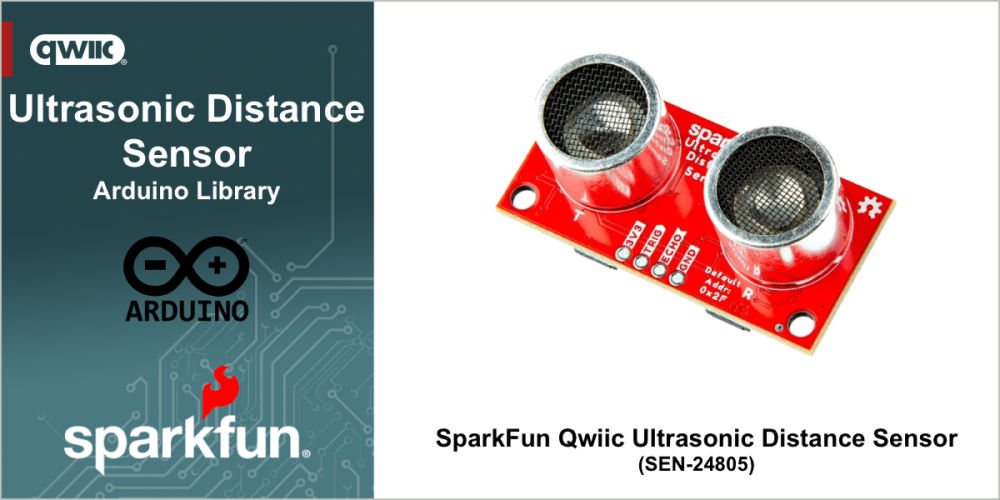

# SparkFun Ultrasonic Distance Sensor - TCT40

Arduino Library for the SparkFun SparkFun Ultrasonic Distance Sensor 


The [SparkFun Ultrasonic Distance Sensor - TCT40 (sen-24805)](https://www.sparkfun.com/sparkfun-ultrasonic-distance-sensor-tct40-qwiic.html) a user-friendly upgrade to the popular HC-SR04 sensor, offers non-contact distance measurement from 2cm to 400cm with an accuracy of 3mm. This sensor is designed to seamlessly integrate with the Qwiic ecosystem for I2C communication, making it a breeze to add to your existing projects and daisy-chain with other Qwiic components.

If you prefer to bypass the Qwiic connector and I2C, you can also access the VCC, Trigger, Echo, and Ground pins broken out on the board's edge. Please be aware that this ultrasonic sensor comes uncalibrated, and you will need to manipulate the raw output for your specific application.

With its wide range of applications, the SparkFun Qwiic Ultrasonic Distance Sensor is a versatile tool for robotics projects, obstacle avoidance systems, and any application that requires accurate distance measurement without physical contact. Its adaptability makes it a valuable addition to your toolkit.

Looking for the board that matches this library - pick up a [SparkFun Ultrasonic Distance Sensor - TCT40 (Qwiic)](https://www.sparkfun.com/sparkfun-ultrasonic-distance-sensor-tct40-qwiic.html) at www.sparkfun.com.

## Functionality

This library provides a simple interface that enables the following functionality when using the SparkFun Qwiic Ultrasonic Distance Sensor:

* Read the distance detected by the sensor
* Change the I2C address of the sensor - if you want to avoid a conflict, or used multiple moisture sensors together. 

## General Use 

The following outlines the general use of the library in an Arduino Sketch. 

### Declaration

At the start of your sketch, the library header file is included using the following statement:

~~~cpp
#include "SparkFun_Qwiic_Ultrasonic_Arduino_Library.h" 
~~~

Before the arduino ```setup()``` function, create a Ultrasonic Distance Sensor object in your file with the following declaration:

~~~c
QwiicUltrasonic myUltrasonic; // Create an instance of the sensor class
~~~

### Initialization

In the Arduino ```setup()``` function, initialize the sensor by calling the begin method. This method is called after the Arduino `Wire` (I2C) library is initialized. 

~~~cpp
// Attempt to begin the sensor
while (myUltrasonic.begin(deviceAddress) == false)
{
    Serial.println("Ultrasonic sensor not connected, check your wiring and I2C address!");
    delay(2000);
}
~~~

The begin method returns true if the sensor is connected and available, and false if it is not. 

### Usage

#### Read Value

To read the value from the sensor, the *triggerAndRead()* method is called on the sensor object.

~~~cpp
uint16_t distance = 0;
myUltrasonic.triggerAndRead(distance);
~~~

The value returned is a distance value measured in millimeters

## Examples

The following examples are provided with the library

- [Basic Readings](examples/Example1_BasicReadings/Example1_BasicReadings.ino) - Setup and read the detected distance value
- [OLED Distance](examples/Example2_OLED_Distance/Example2_OLED_Distance.ino) - Read the sensed distance and display on an OLED display
- [Trigger Echo](examples/Example3_Trigger_Echo/Example3_Trigger_Echo.ino) - Control the sensor and get values manually
- [Change Address](examples/Example4_ChangeAddress/Example4_ChangeAddress.ino) - Change the I2C address of the Ultrasonic Distance sensor device

## Documentation

The full API and use documentation for this library is provided [here](http://docs.sparkfun.com/SparkFun_Qwiic_Ultrasonic_Arduino_Library/). For a quick reference, the main methods available in the library are listed [here](https://docs.sparkfun.com/SparkFun_Qwiic_Ultrasonic_Arduino_Library/class_qwiic_ultrasonic.html).

Curious about the hardware this board works with - visit the SparkFun Qwiic Ultrasonic Distance Sensor [hardware repository](https://github.com/sparkfun/SparkFun_Ultrasonic_Distance_Sensor-Qwiic).

The Hookup Guide for the SparkFun Qwiic Ultrasonic Distance Sensor is available [here](https://docs.sparkfun.com/SparkFun_Ultrasonic_Distance_Sensor-Qwiic/introduction/).

## License Information

This product is ***open source***!

This product is licensed using the [MIT Open Source License](https://opensource.org/license/mit). 
